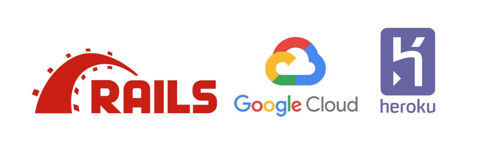

# Setting up Rails 5.2 Active Storage, using Google Cloud Storage and Heroku
## Step-by-step Tutorial

In this tutorial we will create a "Todo" rails app, attach pictures and other files to local disk and to Google Cloud Storage, using Rails Active Storage. Finally we will deploy our App to Heroku using Git.

Level: beginner

Pre requisites: basic knowledge of Rails and Git

Please visit the link to view tutorial on Medium:

https://medium.com/@pjbelo/

You can check the commit history for the different code versions.

Please feel free to contact. I'll be glad to help if I can :-)

Cheers,

Paulo